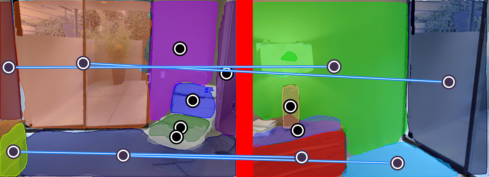
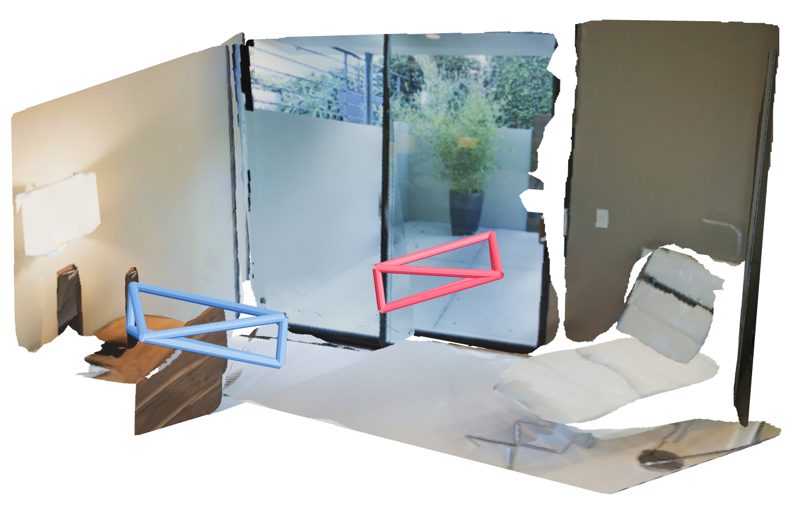

# Demo
Run Sparse Plane Reconstruction on a pair of input images.
Download our pretrained model [model_ICCV.pth][1] and save to `sparsePlane/models`
```bash
cd sparsePlane/models
wget https://www.dropbox.com/s/wdwlm5zltze2zwg/model_ICCV.pth
```
Inference on teaser images.
```
cd sparsePlane
python tools/inference_sparse_plane.py \
--config-file ./tools/demo/config.yaml \
--input ./tools/demo/teaser \
--output ./debug
```
- Predicted correpondence saved as `corr.png`:

- Reconstruction saved as `obj` file:


[1]: https://www.dropbox.com/s/wdwlm5zltze2zwg/model_ICCV.pth

Or you can inference on a list of images by making a txt file
```
cd sparsePlane
python tools/inference_sparse_plane.py \
--config-file ./tools/demo/config.yaml \
--input ./input_dir \
--img-list /path/to/img_list.txt \
--output ./debug
```